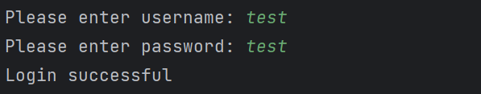
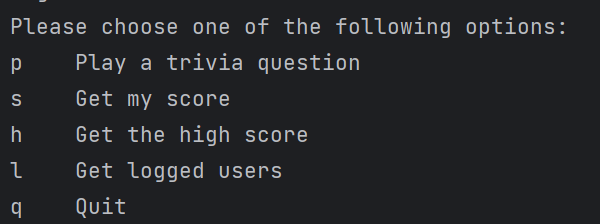
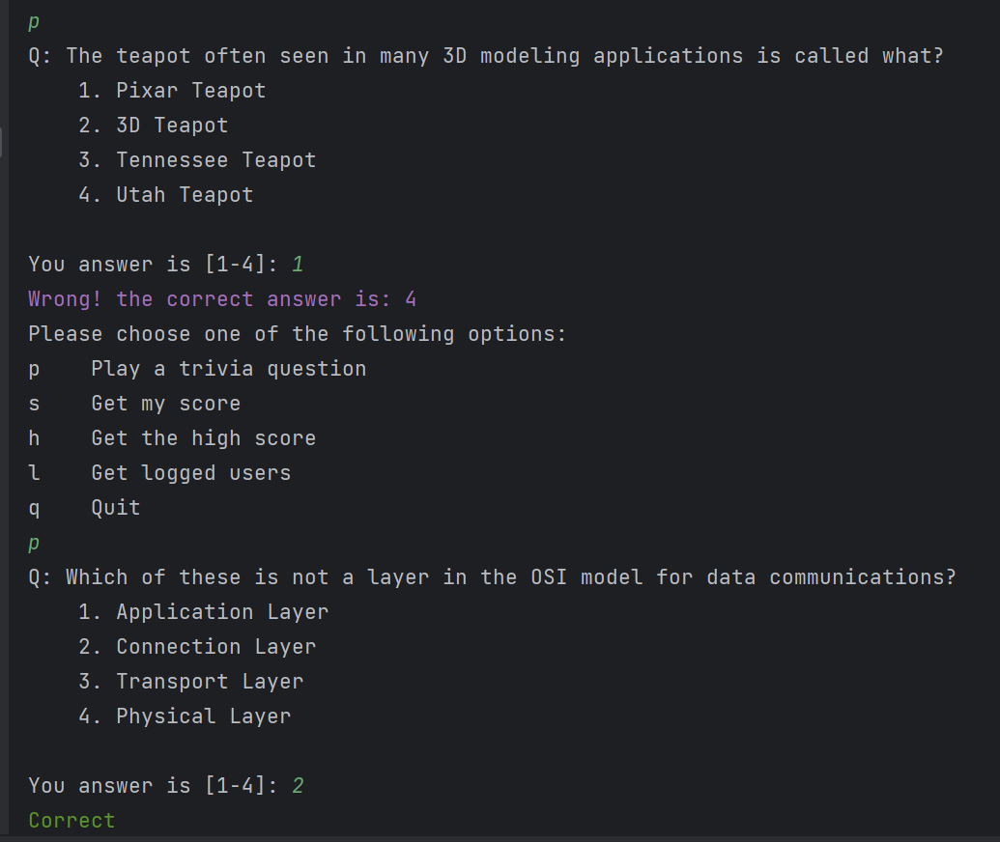
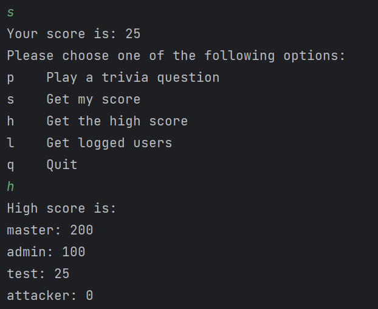
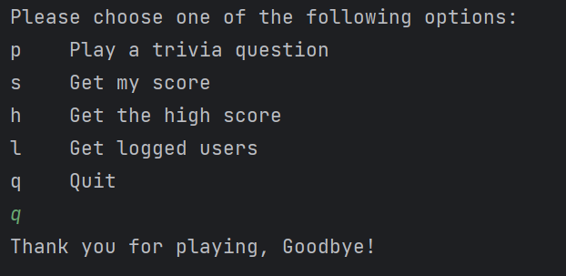
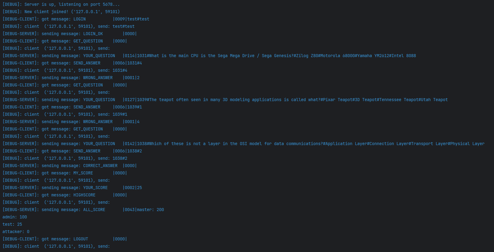

# Trivia Game

## Description

Welcome to the Trivia Game Project! This project showcases the application of network programming concepts to create a
terminal-based trivia game. The game allows multy players to connect via TCP to the server and answer trivia questions
pulled from an API.

## Features

- **Server-Client Architecture**: Utilized Python's socket library to establish communication between the server and
  clients.
- **Question Fetching**: Pulled trivia questions from an external API to provide a variety of questions.
- **File Storage**: Implemented file I/O to save player scores and game data, simulating a database.
- **Multiplayer Support**: Allowed multiple clients to connect simultaneously and compete in the game.
- **Interactive Gameplay**: Provided an engaging user interface in the terminal for players to answer questions.
- **Scoring System**: Tracked and displayed players' scores throughout the game.
- **Graceful Termination**: Ensured that clients and the server can exit gracefully without data loss.

## Screenshots

##### Login

#### Menu

#### Question

#### Get my score, and the leaderboard

#### Exit the game

#### The server debug messages

## Future Enhancements

- Introduce a user-friendly GUI.
- Add a difficulty setting for the questions.
- Add categories for the questions.

## Dependencies

- Python 3.8
- requests 2.31.0

